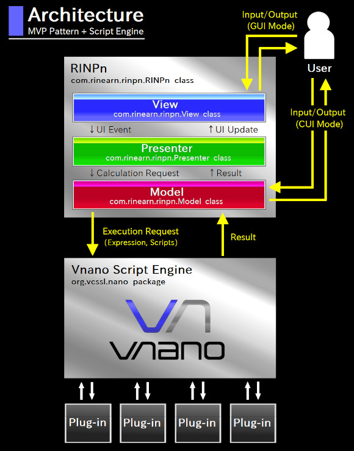

# Software Architecture of the RINPn

&raquo; [Japanese](./Architecture_Japanese.md)

Here we will explain the internal architecture of this software, which help you to grasp the global structure of the implementation before reading source code.

## Abstract and a Block Diagram

The software architecture of the RINPn is a kind of "MVP pattern", which consists mainly of 3 core components: Model, View, and Presenter.
Each component is implemented as a class, in [com.rinearn.rinpn](https://github.com/RINEARN/rinpn/blob/main/src/com/rinearn/rinpn/) package.

In addition, although it is completely independent from the implementation of the RINPn, the script engine of the Vnano to take calculations is also an important component from the point of view of the architecture of the whole software.

The following is a block diagram to grasp relationship between components we mentioned above:

As in the above diagram, 
[RINPn](https://github.com/RINEARN/rinpn/blob/main/src/com/rinearn/rinpn/RINPn.java) 
class is the surface layer of implementation of this software, 
and in there Model/View/Presenter components are combined and work together.
In the following, we will explain the role of each component.

## Model ( [com.rinearn.rinpn.Model](https://github.com/RINEARN/rinpn/blob/main/src/com/rinearn/rinpn/Model.java) class )

The Model is the component provides the functional aspects of the calculator, excluding the UI.
For example, the Model takes a calculation expression as an input, and returns the calculation result (performed by using the script engine) as an output.

In the CUI mode, the RINPn class calls the calculation process of the Model directly, on the main thread.
On the other hand, In the GUI mode, the calculation process of the Model is called from the Presenter as an event-driven process.

## View ( [com.rinearn.rinpn.View](https://github.com/RINEARN/rinpn/blob/main/src/com/rinearn/rinpn/View.java) class )

The View is the component plays the role of the graphical surface of the UI, which composed of a window, text fields, and so on.

Note that, the View does not handle any events which occur when an user has operated the UI components. Such events are handled by the Presenter, not the View. The role of the View is only having/providing UI components.

## Presenter ( [com.rinearn.rinpn.Presenter](https://github.com/RINEARN/rinpn/blob/main/src/com/rinearn/rinpn/presenter/) class )

The Presenter is the component mediates between the Model and the View.

The Presenter class has various event listeners as inner classes.
When an user has operated a View's UI component, the corresponding event listener in the Presenter is called. Then, the listener calls the Model's calculation process, and displays its result by updating the View's UI component.

## Script Engine ( [org.vcssl.nano](https://github.com/RINEARN/vnano/blob/master/src/org/vcssl/nano/) package )

This component takes calculations requested by the Model. 
Executions of scripts, and communications with plug-ins, are also taken by this component.
By the way, this component is being developed independently as the compact script engine "Vnano" for embedded use in applications.
Therefore, for details of this component itself, see the document of: 
[https://github.com/RINEARN/vnano](https://github.com/RINEARN/vnano)

---

## Credits

- Oracle and Java are registered trademarks of Oracle and/or its affiliates. 

- Other names may be either a registered trademarks or trademarks of their respective owners. 

