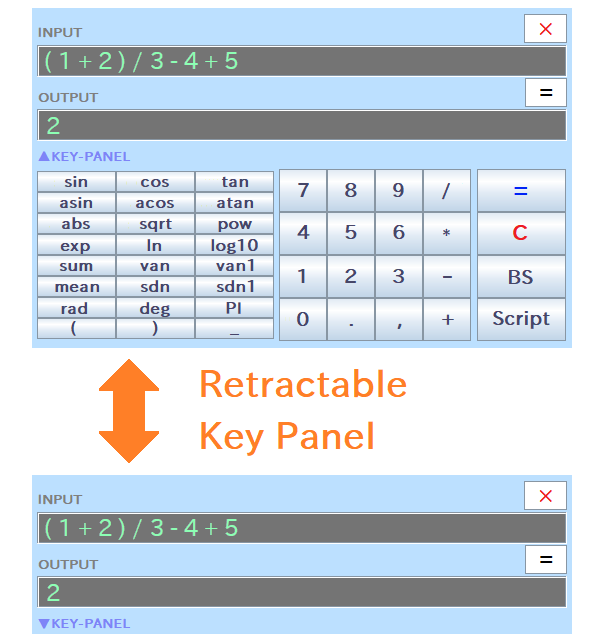

# RINPn

&raquo; [Japanese README](./README_JAPANESE.md)

The RINPn is a powerful scientific calculator software, having simple window. The RINPn is available in both GUI (window) and command-lines, and various math functions are available by default. In addition, you can define new functions, and you can also write/execute scripts for taking complex calculations.

**Note: This README is for users who want to build this software from source code by yourself.
You can also get prebuilt-packages of this software from the following official website.**

### The RINPn Official Website

- English: [https://www.rinearn.com/en-us/rinpn/](https://www.rinearn.com/en-us/rinpn/)</a>
- Japanese:   [https://www.rinearn.com/ja-jp/rinpn/](https://www.rinearn.com/ja-jp/rinpn/)</a>

## Index
- <a href="#version-note">Note</a>
- <a href="#license">License</a>
- <a href="#how-to-build">How to Build</a>
- <a href="#how-to-use">How to Use</a>
- <a href="#architecture">Software Architecture</a>
- <a href="#about-us">About Us</a>

## Note

The RINPn has not officially released yet. 
The current version of the RINPn is a &quot;open beta&quot;.

## License

This software is released under the MIT License.

## How to Build

### Requirements

1. Java&reg; (19 or later)

1. Git

### Building Steps

1. Clone this repository

		cd <working-directory>
		git clone https://github.com/RINEARN/rinpn.git
		cd rinpn

1. Build

		.\build.bat      # For Microsoft Windows
		./build.sh       # For Linux, etc.

		(or, if you are using Apache Ant:  ant -f build.xml )

1. Check

		java -jar RINPn.jar --version
		> RINPn Ver.?.?.?  / with Vnano Ver.?.?.?  (?: numbers)

## How to Use

On Microsoft&reg; Windows&reg;, **double-click the batch file "RINPN_\*.\*.\*.bat" (\*: numbers) to execute the RINPn**. 

On other OS (Linux&reg;, etc.), execute by the following command:

    java -jar RINPn.jar

Also, if the path of "cmd" folder of the RINPn is registered to the environment variable Path/PATH, you can launch the RINPn by more simple command as follows:

    rinpn

When the RINPn is executed, the calculator window will be displayed:

You can retract the key panel by clicking "▲KEY-PANEL" switch, and expand by clicking it again. 
The window color, opacity, font sizes, and so on are customizable by modifying values in "Settings.txt".

On the above window, you can calculate the value of the inputted expression by typing the "Enter" key, or pressing "=" button. Also, you can clear the input field by "Esc" key or "C" button.

In the expression, various math functions such as sin, cos, and so on are available by default (and you can define your original functions).

In addition, by inputting the file name/path of a script written in C-like simple language "[Vnano](https://www.vcssl.org/ja-jp/vnano/)", you can execute it. Instead, you also can select a script file by clicking "Script" button. Scripts are useful for performing complicated calculations automatically.

Also, if the path of "cmd" folder of the RINPn is registered to the environment variable Path/PATH, you can calculate in the command-line as follows:

    rinpn "1 + 2"
	> 3

	rinpn "sin( PI / 2 ) + ( 3 / 2 )"
	> 2.5

	rinpn "Example.vnano"
	> 0.8414709848

For more details, see the user guide document **"RINPn_User_Guide_English.html"** which is attached in this repository. Also, you can see the same guide on the web: 

* [RINPn User Guide](https://www.rinearn.com/en-us/rinpn/guide/)</a>

As introduced in the above user guide (and in this README shortly), the RINPn have many features, e.g.:

* Defining your original functions and variables
* Running scripts written in C-like simple language "[Vnano](https://www.vcssl.org/en-us/vnano/doc/tutorial/language)"
* Calling processes implemented in Java

and so on. In addition, you can use all built-in functions and variables listed in the following page by default:

* [List of built-In functions and variables, provided by Vnano Standard Plug-ins](https://www.vcssl.org/en-us/vnano/plugin/)</a>

The RINPn is a very powerful calculator app, so we can't introduce all features in this short README. At first, please try using the RINPn! Then, see the above documents as needed.

## Software Architecture

The software architecture of the source code of the RINPn is a kind of "MVP pattern", which mainly consists of 3 core components: Model, View, and Presenter.
Each component is implemented as a class, in [com.rinearn.rinpn](https://github.com/RINEARN/rinpn/blob/main/src/com/rinearn/rinpn/) package. In addition, although it is independent from the implementation of the RINPn, [the script engine of the Vnano](https://github.com/RINEARN/vnano) is embedded, which performs calculations and scriptings.

The following is a block diagram to grasp relationship between components we mentioned above:

As in the above diagram, the 
[RINPn](https://github.com/RINEARN/rinpn/blob/main/src/com/rinearn/rinpn/RINPn.java) 
class is the surface layer of implementation of this software, 
and in there Model/View/Presenter components are combined and work together.
In the following, we will explain the role of each component.

### Model ( [com.rinearn.rinpn.Model](https://github.com/RINEARN/rinpn/blob/main/src/com/rinearn/rinpn/Model.java) class )

The Model is the component provides the functional aspects of the calculator, excluding the UI.
For example, the Model takes a calculation expression as an input, and returns the calculation result (performed by using the script engine) as an output.

In the CUI mode, the RINPn class calls the calculation process of the Model directly, on the main thread.
On the other hand, In the GUI mode, the calculation process of the Model is called from the Presenter as an event-driven process.

### View ( [com.rinearn.rinpn.View](https://github.com/RINEARN/rinpn/blob/main/src/com/rinearn/rinpn/View.java) class )

The View is the component plays the role of the graphical surface of the UI, which composed of a window, text fields, and so on.

Note that, the View does not handle any events which occur when an user has operated the UI components. Such events are handled by the Presenter, not the View. The role of the View is only having/providing UI components.

### Presenter ( [com.rinearn.rinpn.Presenter](https://github.com/RINEARN/rinpn/blob/main/src/com/rinearn/rinpn/Presenter.java) class )

The Presenter is the component mediates between the Model and the View.

The Presenter class has various event listeners as inner classes.
When an user has operated a View's UI component, the corresponding event listener in the Presenter is called. Then, the listener calls the Model's calculation process, and displays its result by updating the View's UI component.

### Script Engine ( [org.vcssl.nano](https://github.com/RINEARN/vnano/blob/main/src/org/vcssl/nano/) package )

This script engine performs calculations requested by the Model. 
Executions of scripts, and communications with plug-ins, are also taken by this engine.
This engine is being developed independently as the "Vnano" script engine, for embedded use in applications.
For details of this engine, see the document of: 
[https://github.com/RINEARN/vnano](https://github.com/RINEARN/vnano)

## About Us

The RINPn is developed by a Japanese software development studio: [RINEARN](https://www.rinearn.com/). The author is Fumihiro Matsui.

Please free to contact us if you have any questions, feedbacks, and so on.

---

## Credits

- Oracle and Java are registered trademarks of Oracle and/or its affiliates. 

- Microsoft Windows is either a registered trademarks or trademarks of Microsoft Corporation in the United States and/or other countries. 

- Linux is a trademark of linus torvalds in the United States and/or other countries. 

- Other names may be either a registered trademarks or trademarks of their respective owners. 

