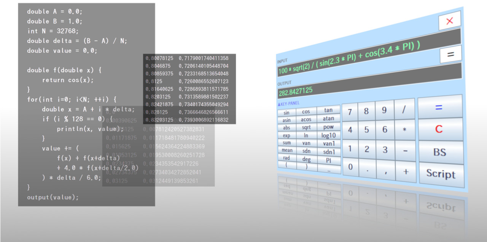

# RINPn

RINPn (RINEARN Processor nano) is a simple & compact programmable calculator.

RINPn (RINEARN Processor nano、発音「りんぷん」) は、シンプルでコンパクトなプログラマブル関数電卓です。

**Note: This README is for users who want to build this software from source code by yourself.
You can also get prebuilt-packages of this software from the following official website.**

**※ このREADMEの内容は、このソフトウェアをソースコードからビルドしたい方のためのものです。
下記公式サイトから、ビルド済みのパッケージも入手できます。**

### The RINPn Official Website - RINPn 公式サイト

- English: [https://www.rinearn.com/en-us/rinpn/](https://www.rinearn.com/en-us/rinpn/)</a>
- 日本語:   [https://www.rinearn.com/ja-jp/rinpn/](https://www.rinearn.com/ja-jp/rinpn/)</a>

## Index - 目次
- <a href="#version-note">Note - 留意事項</a>
- <a href="#license">License - ライセンス</a>
- <a href="#how-to-build">How to Build - ビルド方法</a>
- <a href="#how-to-use">How to Use - 使用方法</a>
- <a href="#architecture">Architecture - アーキテクチャ</a>
- <a href="#about-us">About Us - 開発元について</a>

## Note - 留意事項

The RINPn has not officially released yet. 
The current version of the RINPn is a &quot;open beta&quot;.

RINPn は、まだ正式リリース前のソフトウェアであり、現在はいわゆる「 オープンベータ版 」として公開しています。

## License - ライセンス

This software is released under the MIT License.

このソフトウェアはMITライセンスで公開されています。

## How to Build - ビルド方法

### Requirements - 必要なもの

1. Java&reg; Development Kit (JDK) 8 or later

1. Git

### For Microsoft&reg; Windows&reg; :

1. Clone repositories - リポジトリをローカルに複製

		cd <working-directory>
		git clone https://github.com/RINEARN/vnano.git
		git clone https://github.com/RINEARN/vnano-standard-plugin.git
		git clone https://github.com/RINEARN/rinpn.git

1. Build & copy the Vnano Script Engine - Vnanoスクリプトエンジンのビルドとコピー

		cd vnano
		.\build.bat
		(or:  ant -f build.xml )

		cd ..
		copy .\vnano\Vnano.jar .\rinpn\Vnano.jar

1. Build & copy the Vnano Standard Plug-ins - Vnano標準プラグインのビルドとコピー

		cd vnano-standard-plugin
		.\build.bat
		
		cd ..
		xcopy /s .\vnano-standard-plugin\plugin\* .\rinpn\plugin\
		xcopy .\vnano-standard-plugin\*.html .\rinpn\

1. Build the RINPn - RINPn のビルド

		cd rinpn
		.\build.bat
		(or:  ant -f build.xml )

		cd plugin
		javac -encoding UTF-8 ExamplePlugin.java
		cd ..

1. Check - 確認

		java -jar RINPn.jar --version
		> RINPn Ver.?.?.?  / with Vnano Ver.?.?.?  (?: numbers)

### For Other OS (Linux&reg;, etc.) :

1. Clone repositories - リポジトリをローカルに複製

		cd <working-directory>
		git clone https://github.com/RINEARN/vnano.git
		git clone https://github.com/RINEARN/vnano-standard-plugin.git
		git clone https://github.com/RINEARN/rinpn.git

1. Build & copy the Vnano Script Engine - Vnanoスクリプトエンジンのビルドとコピー

		cd vnano
		chmod +x ./build.sh          # if necessary: sudo ...
		./build.sh                   # or:  ant -f build.xml
		
		cd ..
		cp ./vnano/Vnano.jar ./rinpn/Vnano.jar

1. Build & copy Vnano Standard Plug-ins - Vnano標準プラグインのビルドとコピー

		cd vnano-standard-plugin
		chmod +x ./build.sh          # if necessary: sudo ...
		./build.sh
		
		cd ..
		cp -r ./vnano-standard-plugin/plugin/* ./rinpn/plugin/
		cp ./vnano-standard-plugin/*.html ./rinpn/

1. Build the RINPn - RINPn のビルド

		cd rinpn
		chmod +x ./build.sh          # if necessary: sudo ...
		./build.sh                   # or:  ant -f build.xml

		cd plugin
		javac -encoding UTF-8 ExamplePlugin.java
		cd ..

		cd bin
		chmod +x ./rinpn             # if necessary: sudo ...
		cd ..

1. Check - 確認

		java -jar RINPn.jar --version
		> RINPn Ver.?.?.?  / with Vnano Ver.?.?.?  (?: numbers)

## How to Use - 使用方法

On Microsoft&reg; Windows&reg;, double-click the batch file "RINPN_\*.\*.\*.bat" (\*: numbers) to execute the RINPn. On other OS (Linux&reg;, etc.), execute by the following command:

Microsoft&reg; Windows&reg;上では、バッチファイル "RINPN_\*.\*.\*.bat" をダブルクリックすると起動します。
その他のOS（Linux&reg;など）では、以下のようにコマンドで起動します：

    java -jar RINPn.jar

Also, if the path of "bin" folder of the RINPn is registered to the environment variable Path/PATH, you can launch the RINPn by more simple command as follows:

なお、RINPn の「 bin 」フォルダのパスを環境変数 Path / PATH に登録しておくと、以下のように単純なコマンドで起動できます：

    rinpn

When the RINPn is executed, the calculator window will be displayed:

RINPn が起動されると、以下のような電卓画面が表示されます：

On the above window, you can calculate the value of the inputted expression by typing the "Enter" key, or pressing "=" button. In the expression, various math functions such as sin, cos, and so on are available by default.
The window size, color, opacity, and so on are customizable by modifying values in "Settings.txt".

上の電卓画面上で、計算式を入力して Enter キーを押すか、または「 = 」ボタンを押すと、その式の値を計算できます。式の中では、sin や cos などの各種数学関数も標準で使用できます。
画面の大きさや色、透明度、その他色々は「 Settings.vnano 」内の設定値を変更してカスタマイズできます。

In addition, the RINPn support the scripting language ["Vnano"](https://www.vcssl.org/en-us/vnano/). You can define new functions in the Vnano script file "ExampleLibrary.vnano" in "lib" folder, and use them in the expression inputted to the RINPn.
You also can execute a Vnano script file performing complicated numerical calculations and so on, by inputting the name / path of the script file.

加えて、RINPn はスクリプト言語 [Vnano](https://www.vcssl.org/ja-jp/vnano/) をサポートしています。それにより、「 lib 」フォルダ内にあるスクリプトファイル「 ExampleLibrary.vnano 」の中で自作の関数を定義して、それを RINPn の計算式の中で使用する事もできます。
また、複雑な計算処理などを記述したスクリプトファイルの名前やパスを入力する事で、それを実行する事も可能です。

Also, if the path of "bin" folder of the RINPn is registered to the environment variable Path/PATH, you can calculate in the command-line as follows:

なお、RINPn の bin フォルダのパスを環境変数 Path / PATH に登録しておくと、以下のようにコマンドラインでも計算できます：

    rinpn "1 + 2"
	> 3

	rinpn "sin( PI / 2 ) + 23/ 2"
	> 2.5

	rinpn "Example.vnano"
	> 0.8414709848

For more details, see **"RINPn_User_Guide_English.html"** which is attached in this repository. Also, you can see the same guide on the web: 
[https://www.rinearn.com/en-us/rinpn/guide/](https://www.rinearn.com/en-us/rinpn/guide/)</a>

より詳しい使用方法は、リポジトリ内に同梱されている「 **RINPn_User_Guide_Japanese.html** 」をご参照ください。また、同内容のガイドがWeb上でも参照できます： 
[https://www.rinearn.com/ja-jp/rinpn/guide/](https://www.rinearn.com/ja-jp/rinpn/guide/)</a>

## Architecture - アーキテクチャ

The architecture of source code of the RINPn adopts the MVP pattern which consists mainly of 3 core components: Model, View, and Presenter.
Each component is packed as a package.
Also, the component performing numerical operations and script processings is implemented as ["Vnano Engine"](https://www.vcssl.org/en-us/vnano/) (Vnano.jar) independent of components of the RINPn.

RINPn のソースコードは、
Model / View / Presenter の3つの主要コンポーネントを軸に構成される、MVPパターンに基づくアーキテクチャを採用しています。
各コンポーネントは、それぞれ個別のパッケージとしてまとめられています。
また、数値演算処理やスクリプト処理などを担う部分は、「 [Vnano エンジン](https://www.vcssl.org/ja-jp/vnano/) (Vnano.jar) 」 として、RINPn 本体のコンポーネントとは独立な形で実装されています。

For details, see ["Architecture.md"](./Architecture.md) in this repository.
In that document, we explain the internal architecture of this software, which might help you to grasp the global structure of the implementation of this software, before reading source code.

より詳しい説明は, このリポジトリ内同梱の「 [Architecture.md](./Architecture.md) 」をご参照ください。
上記ドキュメントでは、ソースコードを把握する際の参考となる情報として、このソフトウェアの内部的なアーキテクチャを解説しています。

## About Us - 開発元について

This software is developed by [RINEARN](https://www.rinearn.com/) 
which is a studio in Japan developing software for data-analysis, visualization, computation, and so on.
Please feel free to contact us if you have any questions/feedbacks about this software.

このソフトウェアは、日本の開発スタジオである [RINEARN](https://www.rinearn.com/) が開発しています。
RINEARNでは、主にデータ解析や可視化、計算向けのソフトウェアを開発しています。
このソフトウェアに関するご質問やご意見・ご感想などをお持ちの場合は、ご気軽にお問い合せください。

### Our website - ウェブサイト

- [https://www.rinearn.com/](https://www.rinearn.com/)</a>

---

## Credits - 本文中の商標など

- Oracle and Java are registered trademarks of Oracle and/or its affiliates. 

- Microsoft Windows is either a registered trademarks or trademarks of Microsoft Corporation in the United States and/or other countries. 

- Linux is a trademark of linus torvalds in the United States and/or other countries. 

- Other names may be either a registered trademarks or trademarks of their respective owners. 

- OracleとJavaは、Oracle Corporation 及びその子会社、関連会社の米国及びその他の国における登録商標です。文中の社名、商品名等は各社の商標または登録商標である場合があります。

- Windows は、米国 Microsoft Corporation の米国およびその他の国における登録商標です。

- Linux は、Linus Torvalds 氏の米国およびその他の国における商標または登録商標です。 

- その他、文中に使用されている商標は、その商標を保持する各社の各国における商標または登録商標です。

