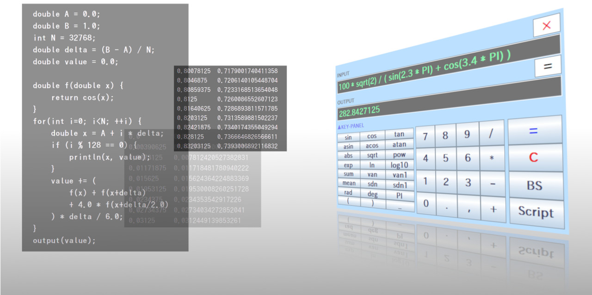
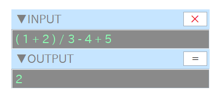
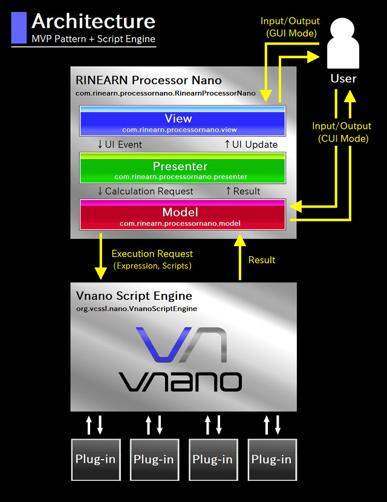

# RINPn

&raquo; [English README](./README.md)

RINPn（RINEARN Processor nano, 発音：りんぷん）は、単純でわかりやすい画面デザインを採用した関数電卓ソフトです。GUIとコマンドラインの両方で利用可能です。標準でいろいろな数学・統計関数が利用でき、ユーザー独自の関数を自作する事も可能です。また、複雑な計算処理をスクリプトとして書いて実行する事もできます。

**※ このREADMEの内容は、このソフトウェアをソースコードからビルドしたい方のためのものです。
下記公式サイトから、ビルド済みのパッケージも入手できます。**

### RINPn 公式サイト

- 日本語:   [https://www.rinearn.com/ja-jp/rinpn/](https://www.rinearn.com/ja-jp/rinpn/)</a>
- 英語: [https://www.rinearn.com/en-us/rinpn/](https://www.rinearn.com/en-us/rinpn/)</a>

## 目次
- <a href="#version-note">留意事項</a>
- <a href="#license">ライセンス</a>
- <a href="#how-to-build">ビルド方法</a>
- <a href="#how-to-use">使用方法</a>
- <a href="#architecture">ソフトウェア アーキテクチャ</a>
- <a href="#about-us">開発元について</a>

## 留意事項

RINPn は、まだ正式リリース前のソフトウェアであり、現在はいわゆる「 オープンベータ版 」として公開しています。

## ライセンス

このソフトウェアはMITライセンスで公開されています。

## ビルド方法

### 必要なもの

1. Java&reg;

1. Git

### ビルド手順

1. このリポジトリを clone します。

		cd <作業フォルダ>
		git clone https://github.com/RINEARN/rinpn.git
		cd rinpn

1. ビルドします。

		.\build.bat      # Microsoft Windows を使用している場合
		./build.sh       # Linux 等を使用している場合

		(or, if you are using Apache Ant:  ant -f build.xml )

1. ビルド結果が実行可能な事を確認します。

		java -jar RINPn.jar --version
		> RINPn Ver.?.?.?  / with Vnano Ver.?.?.?  (? はバージョン番号)

## 使用方法

Microsoft&reg; Windows&reg;上では、**バッチファイル "RINPN_\*.\*.\*.bat" をダブルクリックすると起動します。**

その他のOS（Linux&reg;など）では、以下のようにコマンドで起動します：

    java -jar RINPn.jar

なお、RINPn の「 bin 」フォルダのパスを環境変数 Path / PATH に登録しておくと、以下のように単純なコマンドで起動できます：

    rinpn

RINPn が起動されると、以下のような電卓画面が表示されます：

画面の大きさや色、透明度、その他色々は「 Settings.txt 」内の設定値を変更してカスタマイズできます。

上の電卓画面上で、計算式を入力して Enter キーを押すか、または「 = 」ボタンを押すと、その式の値を計算できます。式の中では、sin や cos など、各種の数学関数が標準で使用可能で、自作もできます。また、式の代わりに、C言語風の簡易言語「 [Vnano](https://www.vcssl.org/ja-jp/vnano/doc/tutorial/language) 」で記述したスクリプトのファイル名/パスを入力する事で、それを実行する事もできます（複雑な計算処理を自動化するのに便利です）。

ところで、RINPn の bin フォルダのパスを環境変数 Path / PATH に登録しておくと、以下のようにコマンドラインでも計算できます：

    rinpn "1 + 2"
	> 3

	rinpn "sin( PI / 2 ) + ( 3 / 2 )"
	> 2.5

	rinpn "Example.vnano"
	> 0.8414709848

より詳しい使用方法は、リポジトリ内に同梱されているユーザーガイド「 **RINPn_User_Guide_Japanese.html** 」をご参照ください。また、同内容のガイドがWeb上でも参照できます：

* [RINPn ユーザーガイド](https://www.rinearn.com/ja-jp/rinpn/guide/)</a>

既に少し触れましたが、上記ガイド内で紹介されているように、RINPn には多くの機能があります。例えば：

* 関数や変数の自作
* C言語風の簡易言語「 [Vnano](https://www.vcssl.org/ja-jp/vnano/doc/tutorial/language) 」で記述したスクリプトの実行
* Java言語で実装した処理の呼び出し

等々です。加えて、以下のページに掲載されている、全ての関数と変数を標準で使用できます：

* [組み込み関数と変数の一覧（Vnano標準プラグインによって提供）](https://www.vcssl.org/ja-jp/vnano/plugin/)</a>

このように、RINPn はとても強力な電卓ソフトで、この短い README 内で全ての機能を説明する事はできません。まずはともかく、ぜひ RINPn を使ってみてください！ そして、必要に応じて、上に挙げたドキュメントなどに目を通してみてください。

## ソフトウェア アーキテクチャ

RINPn のソースコードは、
Model / View / Presenter の3つの主要コンポーネントを軸に構成される、MVPパターンに基づくアーキテクチャを採用しています。
各コンポーネントは、[com.rinearn.rinpn](https://github.com/RINEARN/rinpn/blob/main/src/com/rinearn/rinpn/) パッケージ内に、それぞれ単一のクラスとして実装されています。また、RINPn 本体の実装とは独立していますが、計算処理やスクリプト処理のために、[Vnano のスクリプトエンジン](https://github.com/RINEARN/vnano) が組み込まれています。

下図は、各コンポーネントの関係を把握するためのブロック図です：

上図の通り、
[RINPn](https://github.com/RINEARN/rinpn/blob/main/src/com/rinearn/rinpn/RINPn.java) 
クラスがこのソフトウェアの実装の外枠で、その中で Model/View/Presenter の各コンポーネントが組み合わさって動いています。
以下では、各コンポーネントの役割を解説します。

### Model ( [com.rinearn.rinpn.Model](https://github.com/RINEARN/rinpn/blob/main/src/com/rinearn/rinpn/Model.java) クラス )

Model は、UI部分を除いた、電卓としての機能面を提供するコンポーネントです。
例えば、計算式が入力されると、その計算結果を出力として返します
（計算処理そのものについては、さらに下層のスクリプトエンジンに投げて実行します）

Model の処理は、CUIモードでは、メインスレッド上で RINPn クラスから直接呼ばれます。一方でGUIモードでは、ユーザーのUI操作に応じて、イベント駆動で Presenter から呼ばれます。

### View ( [com.rinearn.rinpn.View](https://github.com/RINEARN/rinpn/blob/main/src/com/rinearn/rinpn/View.java) クラス )

View は、GUIモードにおいて、ウィンドウやテキストフィールドなどで構成される、UIのグラフィカルな表面（見える部分）の役割を担うコンポーネントです。

ただし、View 自身は、UI部品が操作されてもイベントを処理しません。それは後述の Presenter が担います。
View は、単にUI部品をまとめて保持しているだけで、処理らしい処理は行いません。

### Presenter ( [com.rinearn.rinpn.Presenter](https://github.com/RINEARN/rinpn/blob/main/src/com/rinearn/rinpn/Presenter.java) クラス )

Presenter は、GUIモードにおいて、View と Model の間を仲介するコンポーネントです。

Presenter クラスは、内部クラスとして各種のイベントリスナーを持っており、それらが View のUI部品の操作に反応して、Model を呼び出して計算処理を実行し、完了すると View を更新して結果を表示します。

### スクリプトエンジン ( [org.vcssl.nano](https://github.com/RINEARN/vnano/blob/main/src/org/vcssl/nano/) パッケージ )

スクリプトエンジンは、Model から要求された計算を実行する役割を担います。
スクリプトの実行や、プラグインとのやり取りも、このコンポーネントによって行われます。
なお、このコンポーネントは、アプリケーション組み込み用のスクリプトエンジン「 Vnano 」として、このソフトウェアとは独立に開発進行中のものです。
従って、このコンポーネント自身についての詳細は、そちらのドキュメントをご参照ください： 
[https://github.com/RINEARN/vnano](https://github.com/RINEARN/vnano)

## 開発元について

Exevalator は、日本の個人運営の開発スタジオ [RINEARN](https://www.rinearn.com/) が開発しています。著者は松井文宏です。ご質問やフィードバックなどをお持ちの方は、御気軽にどうぞ。

---

## 本文中の商標など

- OracleとJavaは、Oracle Corporation 及びその子会社、関連会社の米国及びその他の国における登録商標です。文中の社名、商品名等は各社の商標または登録商標である場合があります。

- Windows は、米国 Microsoft Corporation の米国およびその他の国における登録商標です。

- Linux は、Linus Torvalds 氏の米国およびその他の国における商標または登録商標です。 

- その他、文中に使用されている商標は、その商標を保持する各社の各国における商標または登録商標です。

