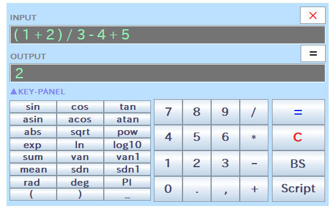
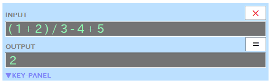

# Introduction - Overview of RINPn and How to Get Started

&raquo; [Japanese](Introduction_Japanese.md)

&raquo; [Ask the AI for help (ChatGPT account required)](https://chatgpt.com/g/g-Hu225rEdv-rinpn-assistant)

On this page, let's download RINPn and get it ready to use!

## What is "RINPn"?

RINPn is a free scientific calculator software featuring a simple interface. Below is an image of the RINPn window:

As shown, the RINPn window has a common UI found in scientific calculators, making it very easy to use.

Despite its simple interface, RINPn offers **powerful features**. You can enter complete expressions (formulas) for calculation, and utilize various mathematical functions and parentheses. Additionally, you can define your own functions or automate processes by writing scripts. The processing speed of RINPn —- ranging from hundreds of MFLOPS to several GFLOPS —- is exceptionally fast for a calculator and also competitive within the realm of scripting languages. Moreover, you can invoke processes implemented in Java&trade; from within calculation expressions and scripts.

> Note: To maximize the processing speed of RINPn, raise the optimization level specified in "Settings.txt."

Furthermore, if needed, you can retract the key panel of RINPn as shown below:

It's hard to imagine that such a compact calculator comes packed with such powerful features!

In essence, RINPn combines a "**small and easy-to-handle**" body with a "**powerful engine**," making it akin to a lightweight sports car in the world of calculators.

## Available for Free - Open Source & MIT License

RINPn is open source software, which means users can access its source code to customize, improve, adapt, and distribute it as needed. The repository hosting the source code is available at: [https://github.com/RINEARN/rinpn](https://github.com/RINEARN/rinpn).

Of course, you are also welcome to use RINPn just like any other conventional software. We welcome users of all types!

RINPn is licensed under the MIT License, a popular open source license. This license allows users to use RINPn freely for both commercial and non-commercial purposes. For more details, search "MIT License" online to find extensive resources explaining the terms.

Additionally, the license document is included in the "License" folder within the distribution package as "MIT_License.txt," and in the source code repository as "LICENSE".

> \- Disclaimer -
>
> RINPn is provided without any warranties.
>
> The developers assume no responsibility or liability for the results of using RINPn, including any errors, damages, etc.
>
> Please ensure you agree with these terms and the conditions of the MIT License before using RINPn.

## Downloading and Preparing to Use RINPn

### Download the Latest Version of RINPn from the Official Website

This document is included in the RINPn package, which you might already have. If not, you can download the latest version of the RINPn package at any time from the official website:

* [The RINPn Official Website](https://www.rinearn.com/en-us/rinpn/)

To download, click the "Download Now" button near the top of the page. This will download a compressed ZIP file named **rinpn\_?\_?\_?\_en.zip** (?\_?\_? are version numbers).

> Note: The package available via the "Download Now" button is a pre-built package, ready for immediate use, and is suitable for most users. However, if you prefer to build RINPn yourself, you can obtain the source code from the following repository:
>
> * [The RINPn Source Code Repository](https://github.com/RINEARN/rinpn)
>
> Clone the repository and follow the build instructions in the README.

### Extract the Downloaded Package

The downloaded file "rinpn\_?\_?\_?\_en.zip" is compressed in ZIP format and must be extracted before use.

For Microsoft&reg; Windows&reg; users, first **right-click the ZIP file, select "Properties," and enable the "Unblock" checkbox at the bottom-right of the window under "Security"** (this prevents potential security warnings or blockings during extraction or when running RINPn). To extract, **right-click the ZIP file again, choose "Extract All," and follow the prompts.**

For users of other operating systems (e.g., Linux&reg;), the ZIP file can typically be extracted via the right-click menu.

> Note: On Linux, the ZIP file can also be extracted using the command line:
>
>        cd (The folder in which the download ZIP file is)
>        unzip -O cp932 rinpn_?_?_?_en.zip    (?_?_? are version numbers)
>
> This method is particularly useful when using the Japanese edition of RINPn, as extracting via the right-click menu might result in "mojibake" (character corruption).

After extraction, a folder named rinpn_?_?_?_en will be created containing all the contents of the RINPn package. **While it is possible to browse the files within the ZIP without extracting, RINPn may not function correctly in this state**. Always extract the files before use.

### Position the Extracted Folder Conveniently (Available Without Installation)

RINPn does not require installation and can be placed anywhere convenient for you, such as the Desktop or a USB drive. This is especially handy if you plan to use RINPn on multiple computers.

We are now ready to launch and explore RINPn in the following chapters: [Step-1 (GUI mode)](Step1.md) and [Step-2 (CUI mode)](Step2.md)!

---

## Credits and Trademarks

* Oracle and Java are registered trademarks of Oracle and/or its affiliates.

* Microsoft Windows is either a registered trademarks or trademarks of Microsoft Corporation in the United States and/or other countries.

* Linux is a trademark of linus torvalds in the United States and/or other countries.

* ChatGPT is a trademark or a registered trademark of OpenAI OpCo, LLC in the United States and other countries.

* Other names may be either a registered trademarks or trademarks of their respective owners.

