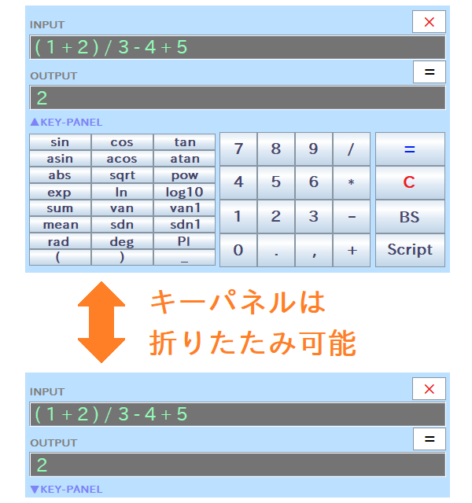

# Step 1 - Using RINPn in GUI Mode

&raquo; [Japanese](Step1_Japanese.md)

&raquo; [Ask the AI for help (ChatGPT account required)](https://chatgpt.com/g/g-Hu225rEdv-rinpn-assistant)

RINPn offers two modes of operation: GUI and CUI. The GUI mode provides a simple calculator interface that is user-friendly and suited for general use. Let's start by exploring the GUI mode!

## Launching RINPn

The method to launch RINPn depends on your operating system.

### For Microsoft&reg; Windows&reg;

To launch RINPn, double-click the batch file "**RINPn\_?.?.?.bat**" (where ?.?.? represents the version numbers). Alternatively, if you have added the "cmd" folder of RINPn to your system's "Path" environment variable, you can start it by entering the "rinpn" command without arguments in the command-line terminal. (&raquo; [More details](Step2.md))

    Note: The first time you launch RINPn, it may perform some initial setup and configuration steps. Please follow the on-screen instructions.

### For Other Operating Systems (Linux&reg;, etc.)

Launch RINPn from the command-line terminal as follows:

    cd (directory where RINPn is located)
    java -jar RINPn.jar

Similarly, if you've registered the "cmd" folder of RINPn in the "PATH" environment variable, you can start it by typing "rinpn" without arguments. (&raquo; [More details](Step2.md))

    Note: If you receive an error message stating that the "java" command is not found, you will need to install the Java® Runtime Environment (JRE).

    A common solution across many operating systems is to install OpenJDK, which includes the Java runtime environment. For installation instructions, search online using keywords such as "OpenJDK install (your OS name)." OpenJDK is also beneficial if you plan to design new functions in Java to be called from RINPn, as it allows you to compile Java code.

    On some Linux distributions, you may be able to install only the JRE using the "apt" command. For more details, search "JRE install (your OS name)." Note that JRE packages installable via the "apt" command might include versions ending in "-headless," which are not compatible with RINPn.

## Calculator Window

Upon successfully launching RINPn, the calculator window below will appear:

You can retract the key panel by clicking "▲KEY-PANEL" switch, and expand by clicking it again. The window color, opacity, font sizes, and so on are customizable by modifying values in "Settings.txt". Simply open the file in a text editor, modify the contents, and save your changes.

## How to Calculate

To perform calculations, enter the expression into the "INPUT" text-field and press the Enter key on your keyboard or click the "=" button on the window. The result will then be displayed in the "OUTPUT" text-field. For example:

    INPUT:
    ( 1 + 2 ) / 3 - 4 + 5

    OUTPUT:
    2

As shown, the calculator correctly handles parentheses "( )" and the order of operations, with multiplication and division taking precedence over addition and subtraction.

\* To clear the input field, press the "Esc" key on your keyboard or click the "C" button on the window.

You can also use functions and variables as follows:

    INPUT:
    sqrt ( sin( PI / 2 ) + 1 )

    OUTPUT:
    1.414213562

Default available functions and variables are listed in the section: Appendix - List of Built-in Functions/Variables. Additionally, you can create and use new functions and variables as described in [Step-4](Step4.md) and [Step-5](Step5.md).

    - About Precision and Rounding -

    In internal processing, RINPn handles numerical values as double-precision (64-bit) binary floating-point numbers. As a result, some numerical errors may be present in the tail digits of calculation results. Therefore, RINPn rounds the results to 10 digits by default (this setting can be customized in "Settings.txt"). When using RINPn, please be aware of these aspects, as the calculator may not be suitable for purposes requiring absolute precision.

---

## Credits and Trademarks

* Oracle and Java are registered trademarks of Oracle and/or its affiliates.

* Microsoft Windows is either a registered trademarks or trademarks of Microsoft Corporation in the United States and/or other countries.

* Linux is a trademark of linus torvalds in the United States and/or other countries.

* ChatGPT is a trademark or a registered trademark of OpenAI OpCo, LLC in the United States and other countries.

* Other names may be either a registered trademarks or trademarks of their respective owners.

