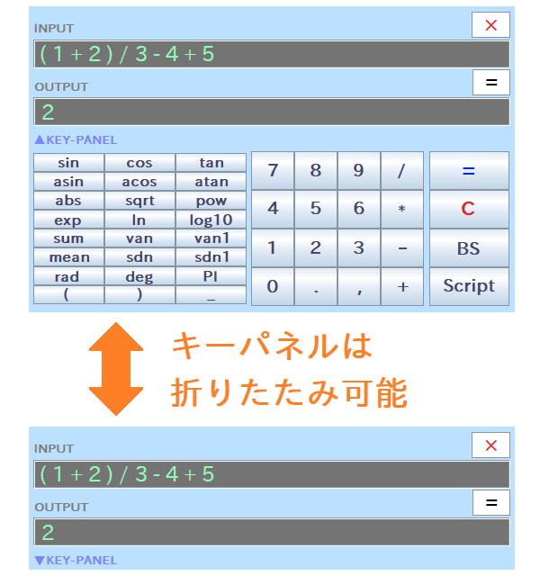

# ステップ 1 - GUIモードで使ってみる (電卓画面での使用)

&raquo; [English](Step1.md)

&raquo; [AIに使い方を聞く（ChatGPTのアカウントが必要）](https://chatgpt.com/g/g-Hu225rEdv-rinpn-assistant)

RINPn には2つのモードがあり、ここで扱うGUIモードでは、グラフィカルな電卓画面上で計算を行う事ができます。 このGUIモードは、恐らくどなたでも簡単に扱う事ができるはずです。 という事で、まずはGUIモードで起動してみましょう！

## 起動方法

起動方法はご使用の環境によって異なりますので、下記の二通りのうち、適した方をお試しください。

### Microsoft&reg; Windows&reg; をご使用の場合

ダウンロード・展開したフォルダ内にある、 「 **RINPn\_?.?.?.bat** (種類はバッチファイル、?の箇所はバージョンの数字) 」 をダブルクリックして起動してください。 なお、ステップ 2 で説明するように「 cmd 」フォルダのパスを環境変数 Path に登録しておくと、 コマンドライン端末上で「 rinpn 」と打って起動する事も可能になります。

> 初回起動時には、必要に応じて色々な準備処理などが始まりますが、 一手一手メッセージで案内されますので、その通りに進めればOKです。 完了すると、RINPn のウィンドウが立ち上がります。

### Linux&reg; やその他の環境をご使用の場合

この場合には、以下のようにコマンドライン端末から入力して起動してください：

    cd ここにRINPnのフォルダの場所(パス)を記述
    java -jar RINPn.jar

なお、ステップ 2 で説明するように「 cmd 」フォルダのパスを環境変数 PATH に登録しておくと、 より単純に「 rinpn 」と打って起動する事も可能になります。

> ※ 上記コマンドを実行した際に、java コマンドが使えない等のエラーが表示される場合は、別途 Java&trade; 言語の実行環境(JRE)の導入が必要です。 その方法は、下記のようにいくつかあります。
>
> 色々なOSで共通して行える方法としては、 OpenJDK という開発環境（実行環境も含まれています）を導入する事が挙げられます。 詳しい導入手順については、「 OpenJDK   インストール   (ここにOSの名前) 」などでWeb検索してみてください。 実行環境目当てで入れるには少し大げさなのですが、RINPn では Java&trade; 言語で自作した処理を呼ぶ事も可能で、 その際には開発環境も必要になるため、入れておくと後々で便利かもしれません。
>
> なお、一部のLinux&reg;ディストリビューションなどでは、apt コマンドなどで、簡単に実行環境のみを導入できる場合もあります。 詳しい手順は 「 JRE   インストール   (ここにOSの名前) 」などでWeb検索してみてください。 ただし、apt コマンド等でJREを導入する場合、名前の末尾に -headless が付いたバージョンを選ぶと RINPn が動作しないので、ご注意ください。

## 起動した電卓画面の様子

上で述べた通りに RINPn を起動すると、以下のような電卓画面が起動します:

電卓画面のキーパネル部は、「▲KEY-PANEL」スイッチをクリックすると収納可能で、もう一度クリックすると再び開けます。 画面の色や透明度、文字の大きさ、その他色々は「 Settings.txt 」内の設定値を変更してカスタマイズできます（普通にテキストエディタで開き、内容を編集して保存してください）。

## 計算方法

計算を行うには、「 INPUT 」欄に計算式を入力し、そのままPCのキーボードの Enter キーを押すか、電卓画面の「 = 」ボタンを押してください。 すると、計算された値が「 OUTPUT 」欄に表示されます。 例えば：

    INPUT:
    ( 1 + 2 ) / 3 - 4 + 5

    OUTPUT:
    2

この通り、かっこ「 ( ) 」や四則演算の順序（かけ算と割り算は、足し算と引き算よりも先に計算されます）などを踏まえた、正しい計算結果が表示されます。

※ 入力した計算式をクリアするには、PCのキーボードの「Esc」キーを押すか、電卓画面の「C」ボタンを押してください。

なお、各種の関数/変数を使った式も計算できます：

    INPUT:
    sqrt ( sin( PI / 2 ) + 1 )

    OUTPUT:
    1.414213562

RINPn で標準で使える主な関数/変数については、 本文書の「 主な組み込み関数/変数 」のページでリストアップして解説しています。 また、ステップ-4 や ステップ-5 の通り、関数/変数を自作する事もできます。

> - 演算精度と丸めについて -
>
> RINPn の内部では、数値は2進数の倍精度浮動小数点数として扱われます。 この事により、表示される計算結果の精度は、多くの場合に有効数字で十数桁程度が目安で、それ以降の桁には各種の誤差が含まれます。 そのため標準では、RINPn は結果を10桁以内に丸めて表示するようになっています（丸め設定は「 Settings.txt 」内で変更できます）。 RINPn をご使用の際は、このような点にご留意ください。 用途や必要な精度によっては、RINPn の使用が適さない場合もあります。

---

## 商標等に関する表記

* Oracle と Java は、Oracle Corporation 及びその子会社、関連会社の米国及びその他の国における登録商標です。文中の社名、商品名等は各社の商標または登録商標である場合があります。

* Microsoft Windows は、米国 Microsoft Corporation の米国およびその他の国における登録商標です。

* Linux は、Linus Torvalds 氏の米国およびその他の国における商標または登録商標です。

* ChatGPT は、米国 OpenAI OpCo, LLC による米国またはその他の国における商標または登録商標です。

* その他、文中に使用されている商標は、その商標を保持する各社の各国における商標または登録商標です。

