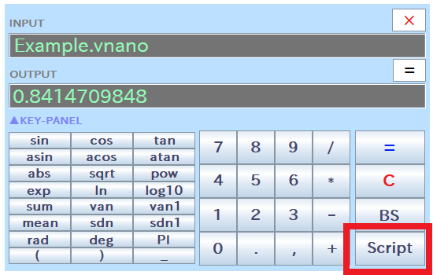

# Step 3 - How to Execute Scripts

RINPn can execute scripts written in "[Vnano](https://www.vcssl.org/en-us/vnano/)" to perform procedural, algorithmic, or other complex calculations.

## What is Vnano?

Vnano is a compact scripting engine and language designed for embedded use in applications. It features a simple C-like syntax. For more details on the syntax of Vnano, visit the "[Features of the Vnano as a Language](https://www.vcssl.org/en-us/vnano/doc/tutorial/language)" page on the Vnano Official Website.

To create a Vnano script, you don't need any development environments such as compilers. Simply create a text file with the ".vnano" extension and write your code within.

## Example Script

An example script, "Example.vnano," is included in the RINPn folder. This script calculates the numerical integration of cos(x) from 0 to 1:

    (The content of "Example.vnano")

    // Integration parameters
    double A = 0.0;
    double B = 1.0;
    int N = 100000;

    // Integrant function
    double f(double x) {
        return cos(x);
    }

    // Perform integration
    double delta = (B - A) / N;
    double value = 0.0;
    for(int i=0; i<N; ++i) {
        double x = A + i * delta;
        value += ( f(x) + f(x+delta) + 4.0 * f(x+delta/2.0) ) * delta / 6.0;
    }

    output(value);

For a detailed explanation of the code above, visit: [https://www.vcssl.org/en-us/code/archive/0001/7800-vnano-integral-output/](https://www.vcssl.org/en-us/code/archive/0001/7800-vnano-integral-output/)

## How to Execute a Script in GUI mode

To execute a script in GUI mode, there are two methods:

* Method 1: Click the "Script" button on the window and select the script file you wish to execute.
* Method 2: Enter the name or path of the script file into the "INPUT" text field, then press the Enter key or click the "=" button to execute it.

Choose the method that you prefer.

For example, to execute the "Example.vnano" script mentioned earlier:

    INPUT:
    Example.vnano

    OUTPUT:
    0.8414709848

As shown above, the output value from the script will be displayed in the "OUTPUT" text field. The output "0.8414709848" closely matches the theoretical value of sin(1), which is the integration result of cos(x) from 0 to 1, confirming that the script has executed correctly.

Additionally, if you are using Microsoft Windows, you can hold down the Shift key and right-click the script file to copy its path from the context menu. This is especially handy when you need to enter the path of the script file into the INPUT text field of RINPn.

## How to Execute a Script in CUI mode

Similar to GUI mode, you can execute a script in CUI mode by entering the name or the path of the script file.

Note: Assuming the "cmd" folder of RINPn is added to your PC's "PATH" environment variable (&raquo; [More details](Step2.md)), and the "rinpn" command is available, here's how to execute a script file in the current directory:

For executing a script file in the current directory, pass only name of the script file to the "rinpn" command:

cd (the directory where the script file is located)

    rinpn Example.vnano
    (Result) 0.8414709848

If the script file is in a different directory than the current one, you can specify the relative file path instead of just the file name:

    # Execute a script in the parent directory
    rinpn ../Example.vnano

    # Execute a script in the "example" directory
    rinpn ./example/Example.vnano

Additionally, if necessary, you can specify the absolute file path as follows:

    rinpn "C:\...\Example.vnano"     # For Microsoft Windows
    rinpn "/home/.../Example.vnano"     # For Linux, etc.

## About Optimization Levels

When processing a script is particularly demanding, you might find it beneficial to increase the optimization level specified in "Settings.txt" under "acceleratorOptimizationLevel" to enhance processing speed.

While the processing speed at an optimization level of 0 is generally sufficient for standard calculator software use, and hence the default level is set to 0, you might need a higher setting if you frequently execute complex numerical calculations on RINPn.

## Get New Scripts from the Code Archive

While you can create scripts from scratch, the code archive on the official VCSSL/Vnano website can also be a valuable resource:

* [Code Archive &raquo; Vnano](https://www.vcssl.org/en-us/code/#vnano)

This archive offers a variety of useful scripts, complete with commentary articles that explain the algorithms, background knowledge, and more.

\- Examples of Scripts Available in the Code Archive -

* [Solve The Lorenz Equations Numerically](https://www.vcssl.org/en-us/code/archive/0001/8000-vnano-lorenz-attractor/): This script solves the Lorenz equations and outputs data to plot the solution curve, famously known as the "Lorenz Attractor," on a 3D graph.

* [Output Data of Numerical Integration For Plotting Graph](https://www.vcssl.org/en-us/code/archive/0001/7900-vnano-integral-for-plot-graph/): An example script that computes integrated values numerically and outputs data for graph plotting.

* [Compute Integral Value Numerically](https://www.vcssl.org/en-us/code/archive/0001/7800-vnano-integral-output/): This script calculates integral values using the rectangular method, trapezoidal method, and Simpson's rule, suitable for numerical integration.

---

## Credits and Trademarks

* Microsoft Windows is either a registered trademarks or trademarks of Microsoft Corporation in the United States and/or other countries.

* Linux is a trademark of linus torvalds in the United States and/or other countries.

* ChatGPT is a trademark or a registered trademark of OpenAI OpCo, LLC in the United States and other countries.

* Other names may be either a registered trademarks or trademarks of their respective owners.

