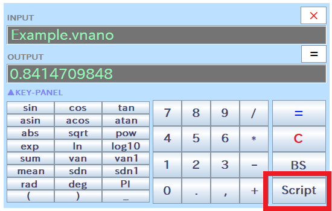

# ステップ 3 - スクリプトを実行する

&raquo; [English](Step3.md)

&raquo; [AIに使い方を聞く（ChatGPTのアカウントが必要）](https://chatgpt.com/g/g-Hu225rEdv-rinpn-assistant)

RINPn では、手続き的な自動計算やアルゴリズム的な計算、またはその他の複雑な処理を行いたい場合のために、 「 [Vnano](https://www.vcssl.org/ja-jp/vnano/) 」 という言語で記述したスクリプト（簡易プログラム）を実行する事もできます。

## Vnano とは？

Vnano は、C言語系の文法を持つ、ソフトウェア内組み込み用のスクリプト言語＆エンジンです。 具体的な書き方については、Vnano 公式サイト内の 「 [言語としてのVnano](https://www.vcssl.org/ja-jp/vnano/doc/tutorial/language) 」 のページをご参照ください。 Vnano のスクリプトを作成するには、好きなエディタで拡張子「 .vnano 」で終わる名前のテキストファイルを作成し、その中にコードを書くだけでOKです。 文字コードは標準では UTF-8 で読まれます。

## サンプルスクリプト

記述例として、RINPn のフォルダ直下に以下のスクリプトファイル「 Example.vnano 」が同梱されています。 このスクリプトは、cos(x) の 0 から 1 までの数値積分値を計算する内容になっています：

    (Example.vnano をテキストエディタで開いた内容)

    // 積分パラメータ
    double A = 0.0;
    double B = 1.0;
    int N = 100000;

    // 被積分関数
    double f(double x) {
        return cos(x);
    }

    // 積分を実行
    double delta = (B - A) / N;
    double value = 0.0;
    for(int i=0; i<N; ++i) {
        double x = A + i * delta;
        value += ( f(x) + f(x+delta) + 4.0 * f(x+delta/2.0) ) * delta / 6.0;
    }

    // 結果を出力
    output(value);

上記コード内容の詳しい解説については、こちらをご参照ください： [https://www.vcssl.org/ja-jp/code/archive/0001/7800-vnano-integral-output/](https://www.vcssl.org/ja-jp/code/archive/0001/7800-vnano-integral-output/)

## GUIモードでのスクリプト実行方法

GUIモードでスクリプトを実行するには、次の2通りの方法があります：

方法 1: 電卓画面の「 Script 」ボタンを押し、画面上でスクリプトファイルを選んで実行します。
方法 2: スクリプトファイルの名前（またはパス）を、電卓画面の「 INPUT 」欄に直接入力して、「 = 」ボタンか Enter キーを押して実行します。
どちらでも好みの方法で実行してください。

例として、上で見たサンプルスクリプト「 Example.vnano 」を実行してみましょう：

    INPUT:
    Example.vnano

    OUTPUT:
    0.8414709848

このように、「 OUTPUT 」欄にスクリプトの出力値が表示されます。 この出力値「 0.8414709848 」は、cos(x) の 0 から 1 までの積分の理論値である sin(1) とよく一致しており、 サンプルスクリプトの内容が正しく解釈・実行された事がわかります。

なお、Microsoft&reg; Windows&reg; をご使用の場合は、 Shiftキーを押しながらスクリプトファイルを右クリックすると、メニューからパスをコピーできるので、 RINPn の INPUT 欄にスクリプトのパスを入力する際に便利です。

## CUIモードでのスクリプト実行方法

CUIモードでも、計算式の代わりにスクリプトファイルを指定する事で、そのスクリプトを実行できます。

※ この使い方では、RINPn の「 cmd 」フォルダのパスをOSに登録せずに使う事は現実的に考え辛いため（ [パス登録の利点と方法についてはこちら](Step2_Japanese.md) ）、以下ではあらかじめパスは登録されていて、rinpn コマンドが使用可能である事を前提に説明します。

コマンドライン入力端末の**カレントディレクトリ内にあるスクリプトファイル**は、 以下のように、rinpn コマンドの引数に**ファイル名のみを指定して実行可能**です：

    cd 実行したいスクリプトファイル(Example.vnano)のある場所

    rinpn Example.vnano
    (結果) 0.8414709848

また、**カレントディレクトリを基準とする相対パス** でスクリプトファイルを指定する事もできます。 これは、カレントディレクトリ内には無いものの、 近い場所（すぐ上や下の階層など）にあるスクリプトファイルを実行したい場合に便利です：

    rinpn ../Example.vnano     (上の階層にあるスクリプトを実行)
    rinpn ./example/Example.vnano     (exampleフォルダ内のスクリプトを実行)

加えて、以下のように **絶対パス** でスクリプトファイルを指定する事も可能です：

    rinpn "C:\...\Example.vnano"     (Microsoft Windows をご使用の場合など)
    rinpn "/home/.../Example.vnano"     (Linux をご使用の場合など)

以上の通り、CUIモードでは3通りの方法でスクリプトファイルの指定が可能です。 場面に応じて、便利に思える指定方法を使い分けてください。

## 最適化レベルについて: スクリプトの実行が重い時は…

ところで、スクリプトの実行処理が重い場合は、 「 Settings.txt 」内で「 acceleratorOptimizationLevel 」として設定されている最適化レベルの値を上げると、処理が速くなります。

最適化レベルを最低の 0 に設定しても、恐らく一般的な電卓の用途としては十分な性能が得られるため、標準では安定性を優先し、最適化レベルは 0 に設定されています。 ただ、RINPN で数値計算プログラムを頻繁に実行される方には、標準の最適化レベルではややパフォーマンスが不足気味かもしれません。

## コードアーカイブからスクリプトを入手しよう！

スクリプトは、もちろん自分で書くこともできますが、VCSSL/Vnano公式サイト内の、下記コードアーカイブでも配信しています：

* [コードアーカイブ &raquo; Vnano版のコード](https://www.vcssl.org/ja-jp/code/#vnano)

コード内容の解説記事も掲載していますので、別のスクリプトを書く際の参考や、改造/流用のベースとしても使えます。ぜひご活用ください！

\- 配信プログラム例 -

* [ローレンツ方程式を数値的に解くスクリプト](https://www.vcssl.org/ja-jp/code/archive/0001/8000-vnano-lorenz-attractor/): ローレンツ方程式を4次ルンゲ=クッタ法によって解き、グラフ描画用のデータを出力するスクリプトです。
* [積分値のグラフ描画用データを出力するスクリプト](https://www.vcssl.org/ja-jp/code/archive/0001/7900-vnano-integral-for-plot-graph/): 数値的に積分を行い、結果の関数をグラフに描くためのデータを出力するスクリプトです。
* [積分値を求めるスクリプト (数値積分)](https://www.vcssl.org/ja-jp/code/archive/0001/7800-vnano-integral-output/): 矩形法/台形法/シンプソン法を用いて、積分の値を数値的に求めるスクリプトです。

---

## 商標等に関する表記

* Microsoft Windows は、米国 Microsoft Corporation の米国およびその他の国における登録商標です。

* Linux は、Linus Torvalds 氏の米国およびその他の国における商標または登録商標です。

* ChatGPT は、米国 OpenAI OpCo, LLC による米国またはその他の国における商標または登録商標です。

* その他、文中に使用されている商標は、その商標を保持する各社の各国における商標または登録商標です。
